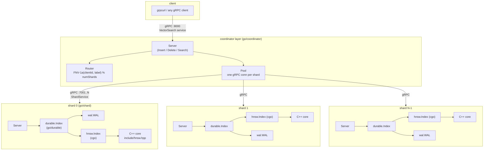
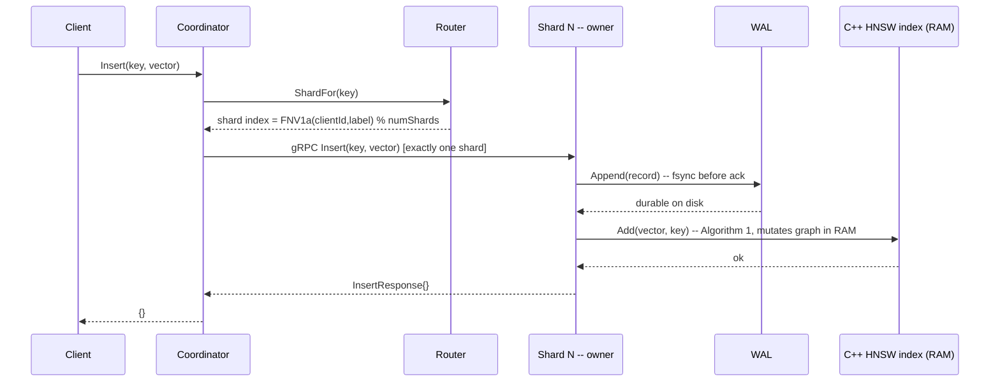
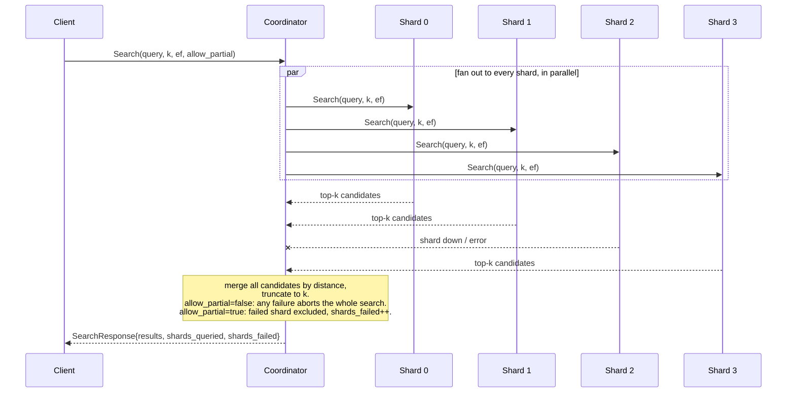
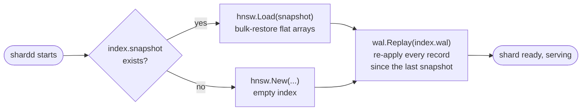
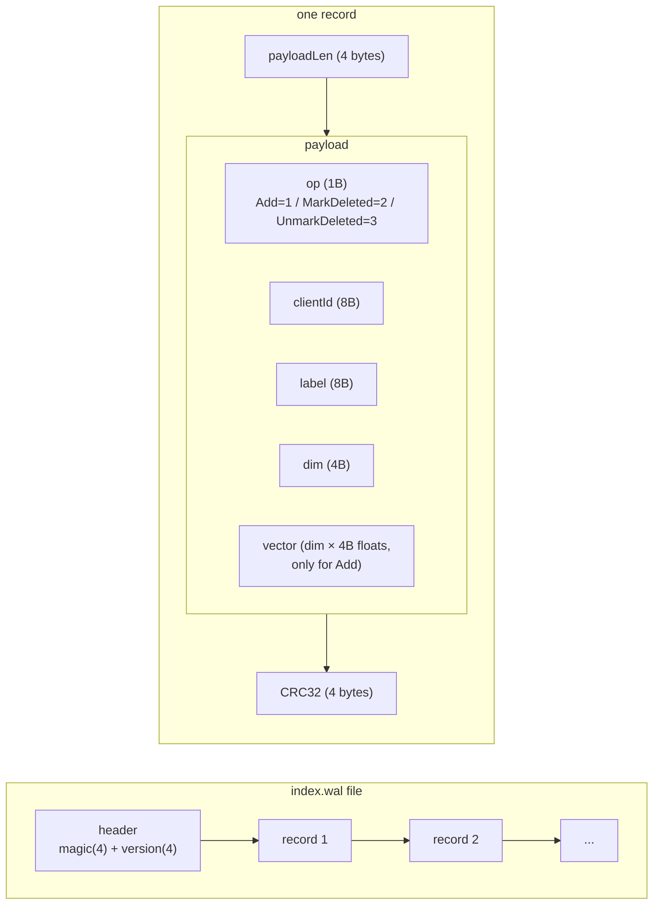
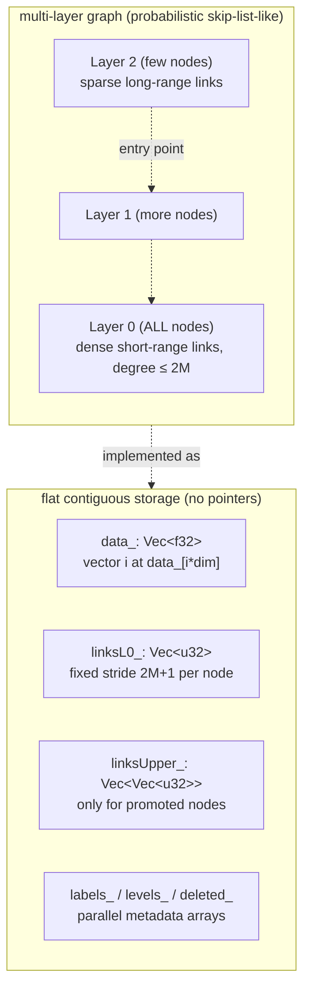
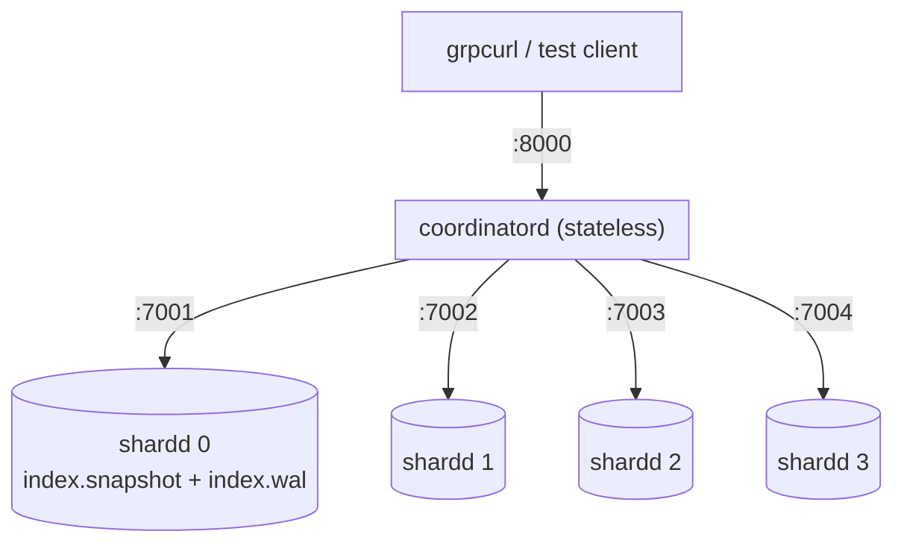
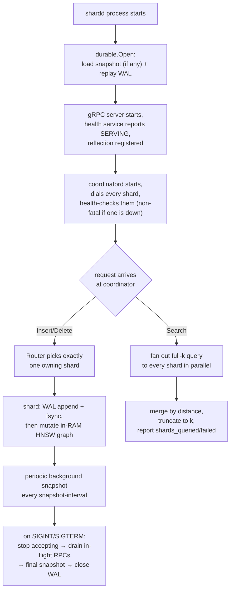

# Architecture: end-to-end walkthrough

This ties together the whole system — C++ core, cgo boundary, and the Go
shard/coordinator layer — into one picture: what happens on every request,
how data survives a crash, and how it scales past one machine. For deep
detail on any one piece, see [DOCUMENTATION.md](DOCUMENTATION.md) (the HNSW
algorithm itself, line by line) and [WAL.md](WAL.md) (the write-ahead log
format and the bugs that shaped it). This document is the map connecting
them, plus the parts neither covers: routing, scatter-gather, and the
cluster as a whole.

## 1. What this is

A distributed vector search engine, built up in three layers:

1. **A C++ HNSW index** (`include/hnsw.hpp`) — the actual nearest-neighbour
   data structure and algorithm, in-memory, single-process.
2. **A durability layer around it** (`go/durable`, `go/wal`) — a write-ahead
   log plus periodic snapshots, so the in-memory graph survives a crash.
3. **A sharding layer around that** (`go/shard`, `go/coordinator`) — many
   independent shard processes, each holding one durable HNSW index, fronted
   by a stateless coordinator that routes writes and fans out reads.

Nothing here is a wrapper around Postgres/Redis/etc — the storage engine,
the durability mechanism, and the distribution mechanism are all
purpose-built for this one job: nearest-neighbour search over vectors, at a
scale bounded by however many shards you run rather than by one machine's
RAM.

## 2. Section-wise diagrams

### 2.1 Layered architecture

Each shard is a fully independent OS process: its own memory, its own WAL
file, its own snapshot file. The coordinator holds no vector data at all —
it is pure routing config plus gRPC connections (see
`go/coordinator/pool.go`, `go/coordinator/router.go`).

### 2.2 Insert flow (one write)

The key property: a write is only acknowledged after the WAL `fsync`
succeeds, *before* the in-memory graph is even touched. If the process dies
between those two steps, the WAL record is still there and gets replayed on
restart — see §2.4. This is exactly what the [4.2 routing test](DEPLOYMENT.md)
and [4.4 crash-recovery test](DEPLOYMENT.md) verify in practice: only the
owning shard's WAL grows, and a hard-killed shard's data is still there on
restart.

### 2.3 Search flow (scatter-gather)

Every shard is asked for the **full k**, not `k / numShards` — asking each
shard for a fraction and merging would silently drop correct results
whenever the true top-k isn't evenly spread across shards (`go/coordinator/gather.go`
documents this explicitly, and `src/shard_sim.cpp` has the simulation that
proved it). This is why `shards_queried` / `shards_failed` are always
returned, even on full success: a caller who logs "4/4 shards" on the happy
path notices immediately when it silently becomes "3/4".

### 2.4 Crash recovery (what happens on restart)

Snapshot = fast bulk restore of *most* of the graph; WAL replay = catches up
the small remainder written after that snapshot. Recovery always needs
**both** — a snapshot alone would silently lose everything written since it
was taken (`go/durable/durable.go:59-70`, verified live in the [crash-recovery
test](DEPLOYMENT.md) — vector counts matched exactly across a hard kill).

### 2.5 WAL record format

Every record is length-prefixed and CRC32-checksummed independently, so
`Replay` can detect and stop cleanly at a torn write (a record half-written
when the process died) instead of misreading garbage as the next record —
see `readRecord` in `go/wal/wal.go`.

### 2.6 HNSW graph structure (in-memory, per shard)

Search descends greedily through the sparse upper layers to get close fast,
then does a wider beam search at layer 0 where every node actually lives —
full detail (Algorithms 1–5 from Malkov & Yashunin) is in
[DOCUMENTATION.md §5-9](DOCUMENTATION.md).

### 2.7 Local deployment topology (docker-compose / start_local_cluster.ps1)

Same topology whether run as raw OS processes (PowerShell scripts) or as
containers (`docker-compose.yml`) — see [DEPLOYMENT.md](DEPLOYMENT.md) and
[deployflowcommands.md](deployflowcommands.md) for the hands-on walkthroughs
of both.

## 3. Core algorithms, at a glance

| algorithm | where | what it does |
|---|---|---|
| **Insert** (Algorithm 1) | `hnsw.hpp` | Pick a random level for the new node (exponentially decaying probability of going higher), greedily descend from the entry point down to that level, then beam-search + connect at each layer from there down to 0 |
| **Search** (Algorithms 2+5) | `hnsw.hpp` | Greedy single-path descent through upper layers (ef=1) to get near the target fast, then a wider beam search (size `ef`) at layer 0 for the real top-k |
| **Neighbour selection heuristic** (Algorithm 4) | `hnsw.hpp` | When a node has more candidate neighbours than its degree budget, prefer neighbours that aren't already well-covered by an existing kept neighbour, instead of just keeping the k closest — this is what keeps the graph navigable instead of degenerating into local clusters |
| **Distance** | `hnsw.hpp` | AVX2-accelerated squared L2, or cosine via pre-normalized inner product (normalize once at insert, so search is a plain dot product) |
| **Routing hash** | `go/coordinator/router.go` | `FNV-1a(clientId ++ label) % numShards` — stateless, deterministic, every coordinator process computes the same answer with no coordination or lookup table |
| **Scatter-gather merge** | `go/coordinator/gather.go` | Fan out full-k search to every shard in parallel (`errgroup`), merge all returned candidates by distance, truncate to k |
| **WAL replay** | `go/wal/wal.go` | Sequential read of length-prefixed, CRC-checked records; stops cleanly at the first corrupt/torn record rather than erroring the whole recovery |
| **Snapshot + compaction** | `go/durable/durable.go` | Full lock, dump flat arrays to a temp file, atomic rename into place, then rotate (close + recreate) the WAL — old WAL entries are now redundant and safely discarded |

## 4. Request flow, start to finish

## 5. Specializations — what's deliberately unusual here

- **Flat, contiguous, pointer-free storage.** Vectors and graph edges are
  plain arrays indexed by ID, not heap-allocated nodes with pointers —
  cache-friendly and avoids per-vector allocation overhead. See
  [DOCUMENTATION.md §3](DOCUMENTATION.md).
- **AVX2 distance kernels + the cosine-via-normalization trick.** Cosine
  similarity is computed as a plain dot product on pre-normalized vectors,
  so the hot path never does the more expensive full cosine formula per
  comparison.
- **Composite (clientId, label) keys, not a single ID.** Two different
  logical clients can reuse the same label without colliding — identity is
  the exact pair, not a hash of it (`hnsw.go`'s `Key` type).
- **WAL-before-apply ordering**, not write-behind — a client never gets an
  ack for a write that isn't already crash-safe. The append is fsync'd
  *before* the in-memory graph is touched, not after (see [WAL.md](WAL.md)
  for the two real bugs this exact ordering was built to survive).
- **Full-k fan-out on search, never `k/numShards`.** Documented explicitly
  as a rejected shortcut (`go/coordinator/gather.go`) because it can
  silently under-return the true top-k.
- **`allow_partial` as an explicit, caller-chosen tradeoff**, defaulting to
  fail-closed. Availability-over-completeness is never the silent default.
- **Stateless coordinator, deterministic hash routing.** No shard-membership
  discovery, no rebalancing, no coordination between coordinator instances —
  every coordinator computes the same routing decision independently.
- **gRPC server reflection registered on every service.** `grpcurl` (and any
  other reflection-aware client) can call methods with zero `.proto` files
  on the client side — this is what made the hands-on cluster testing in
  [DEPLOYMENT.md](DEPLOYMENT.md) possible without generating client stubs.
- **Per-node fine-grained locking in the C++ core, not one global mutex** —
  concurrent inserts and searches don't serialize on each other except where
  they actually touch the same node (verified under ThreadSanitizer; see
  `hnsw_stress.exe` / `go/shard/server_test.go`).
- **Length-prefixed, independently checksummed WAL records** rather than a
  single whole-file checksum — recovery can stop cleanly at the exact point
  of a torn write instead of failing the entire replay.

## 6. Where this stands, and what's still ahead

Built and verified so far (phase 1 + phase 2, per the hands-on cluster
testing in [DEPLOYMENT.md](DEPLOYMENT.md)):

- Single-process HNSW: insert, search, soft-delete, save/load, concurrency
- Durability: WAL + snapshot, crash recovery, verified via hard-kill testing
- Sharding: deterministic routing, scatter-gather search, partial-failure
  handling, verified against real gRPC calls (native processes and containers)

Not yet built — genuine gaps, not silently-assumed-solved:

- **No dynamic shard membership.** Shard count is fixed config at
  coordinator startup (`go/coordinator/pool.go` — "no discovery mechanism
  and no reshuffling at runtime"). Adding a shard today means redeploying
  every coordinator with a new address list and living with the fact that
  existing keys' routing (`hash % numShards`) shifts entirely — there is no
  consistent-hashing or resharding migration path.
- **No shard replication.** Each shard is a single point of failure for its
  slice of data between the last snapshot and a crash; there's no
  read-replica or multi-node consensus (e.g. Raft) backing an individual
  shard.
- **No batch insert RPC.** `InsertRequest` carries exactly one vector; bulk
  loading today means one round-trip per vector (this is why the ef-sweep
  test in this project's hands-on testing wrote a throwaway loader instead
  of using it directly for thousands of vectors).
- **Snapshotting stalls all writes** on that shard for its duration
  (`go/durable/durable.go`'s `Index.mu` comment documents this tradeoff
  directly and names the fix: copy-on-write or fork-based snapshotting in
  the C++ layer, not yet implemented).
- **`-march=native`** in `CMakeLists.txt` ties the compiled `.so`/binaries to
  the exact CPU features of the build machine — fine for same-machine
  build+run (native dev loop, or a container built and run on one host), a
  real portability hazard the moment an image or binary moves to different
  hardware.
- **No auth, no TLS.** Every example here uses `-plaintext` gRPC with no
  credentials — appropriate for local hands-on testing, not for anything
  reachable off a single machine.
- **No metrics/observability beyond logs.** There's structured `slog`
  logging throughout, but no exported Prometheus metrics, tracing, or
  dashboards for latency/error-rate/shard-health over time.
- **`CLUSTER_ARCHITECTURE.md`, referenced by comments in
  `go/coordinator/gather.go` and `go/coordinator/pool.go`, does not actually
  exist in the repo** — those comments point at a document that was
  apparently never written or was lost; this file (`ARCHITECTURE.md`) is
  the closest thing to it today, but the specific sections those comments
  cite (e.g. "section 4", "section 8") don't correspond to anything here yet.
