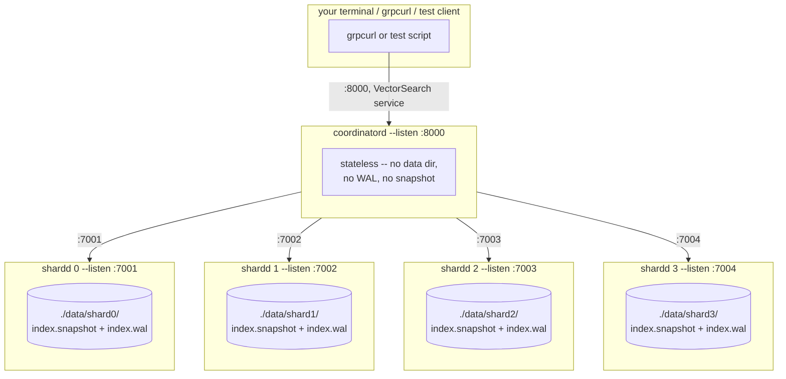

# Local deployment: hands-on testing

This runs the real thing as separate OS processes on your machine — 4 shard
servers plus 1 coordinator, all talking real gRPC over real TCP ports. This
is deliberately the simplest possible deployment (no Docker, no orchestration)
so the first thing you test is *your code*, not your container setup.

## 1. Topology



Five OS processes total. Each `shardd` is independent — separate data
directory, separate WAL, separate snapshot file. `coordinatord` holds nothing
on disk at all; it's pure routing config plus gRPC connections, exactly per
the "stateless coordinator" design.

## 2. The Windows-specific gotcha, before you hit it

`go/hnsw/hnsw.go`'s cgo directive uses `-Wl,-rpath,...` to tell the built
binary where to find `libhnsw.so` at runtime:

```
#cgo LDFLAGS: -L${SRCDIR}/../../build -Wl,-rpath,${SRCDIR}/../../build -lhnsw -lstdc++ -lm
```

**`rpath` is an ELF (Linux) mechanism. It does nothing on Windows.** PE/COFF
binaries (what MinGW produces) have no equivalent embedded search path — the
Windows loader looks for DLLs next to the `.exe`, then on `PATH`, and that's
essentially it. So `shardd.exe` and `coordinatord.exe` will build fine and
then fail immediately on launch with something like:

```
The code execution cannot proceed because libhnsw.dll was not found.
```

This isn't a bug in your code — the rpath flag was written and tested on
Linux and I didn't carry the Windows case. Two fixes, either is fine:

- **Copy the DLL next to each `.exe`** (what the script below does — simplest,
  no environment state to remember)
- **Add the build directory to `PATH`** for the session (`$env:PATH += ...`) —
  less duplication if you rebuild often, but easy to forget between sessions

## 3. Build and launch

From the repo root, in PowerShell:

```powershell
# 1. Build the C++ shared library (skip if already built)
cmake -B build -G Ninja
cmake --build build -j

# 2. Build both binaries
cd go
go build -o ..\bin\shardd.exe .\cmd\shardd
go build -o ..\bin\coordinatord.exe .\cmd\coordinatord
cd ..

# 3. Run the cluster
.\scripts\start_local_cluster.ps1
```

`start_local_cluster.ps1` (below) does the DLL copy, starts 4 shards with a
small `dim` for a fast smoke test, waits for each port to accept connections
before moving on, then starts the coordinator. Logs go to `.\logs\*.log`;
process IDs go to `.\logs\pids.txt` so the stop script can find them.

Adjust `-Dim` to your real embedding dimension once the smoke test passes —
128, 384, 768, whatever your actual data uses. All 4 shards and the
coordinator's expectations must agree, since a dimension mismatch is
rejected per-request (`InvalidArgument`), not silently handled.

## 4. Hands-on test plan

Don't just insert-and-search once — walk through the properties the design
actually claims, since "it ran without an error" and "it's correct" are
different things.

**4.1 — basic insert and search.** Confirm the coordinator answers at all.

**4.2 — routing.** Insert a vector, then check *which shard's data directory*
actually grew (`Get-ChildItem .\data\shard*\index.wal` — file size changes on
the shard that got the write, others don't). Confirms routing isn't secretly
broadcasting writes to every shard.

**4.3 — kill a shard, confirm `allow_partial` behavior.** Stop one `shardd`
process. Search with `allow_partial=false` (or omitted — that's the default)
and confirm it fails. Search with `allow_partial=true` and confirm you get
results plus `shards_failed: 1`. This is the one property that's easy to get
backwards in a real deployment (defaults matter — confirm the *default*
really is fail-fast, not the permissive one).

**4.4 — crash recovery.** Insert some vectors, then kill a shard process
**without** a graceful shutdown (`Stop-Process -Force`, not Ctrl+C — you want
to skip the final snapshot). Restart that exact `shardd` command. Query it
directly (or through the coordinator) and confirm every previously-inserted
vector is still there. This is the WAL doing its job under conditions closer
to a real crash than any test harness fully replicates.

**4.5 — the recall/latency tradeoff, live.** Insert a few thousand vectors,
then run the same search at `ef=10` and `ef=200` and eyeball the latency
difference. This is the number you already have from `shard_sim.cpp` and
`benchmark.cpp` — seeing it come back over real gRPC calls, with real
serialization overhead included, is worth doing once.

## 5. Testing with grpcurl

[grpcurl](https://github.com/fullstorydev/grpcurl) talks to a gRPC server
using reflection, which both `shardd` and `coordinatord` already register —
no `.proto` files needed on the client side.

Install (Windows): `scoop install grpcurl` or download the release binary
directly from the grpcurl GitHub releases page.

```powershell
# list services -- confirms reflection works and shows exact method names
grpcurl -plaintext localhost:8000 list

# insert a vector (dim must match what you started the shards with)
grpcurl -plaintext -d '{
  \"key\": {\"client_id\": 1, \"label\": 42},
  \"vector\": [0.1, 0.2, 0.3, 0.4, 0.5, 0.6, 0.7, 0.8]
}' localhost:8000 vectorsearch.coordinator.v1.VectorSearch/Insert

# search
grpcurl -plaintext -d '{
  \"query\": [0.1, 0.2, 0.3, 0.4, 0.5, 0.6, 0.7, 0.8],
  \"k\": 5,
  \"ef\": 50
}' localhost:8000 vectorsearch.coordinator.v1.VectorSearch/Search

# delete
grpcurl -plaintext -d '{"key": {"client_id": 1, "label": 42}}' \
  localhost:8000 vectorsearch.coordinator.v1.VectorSearch/Delete

# talk to a shard directly, bypassing the coordinator -- useful for step 4.2
grpcurl -plaintext localhost:7001 vectorsearch.shard.v1.ShardService/Stats
```

Note the fully-qualified method names come straight from the `package` and
`service` declarations in the `.proto` files
(`vectorsearch.coordinator.v1.VectorSearch`, `vectorsearch.shard.v1.ShardService`)
— not something to guess at.

## 6. Shutting down

```powershell
.\scripts\stop_local_cluster.ps1
```

Sends `Ctrl+C`-equivalent (`taskkill` without `/F`) where possible so the
graceful shutdown path runs — each `shardd` takes a final snapshot before
exiting, per the shutdown ordering in `cmd/shardd/main.go`. Use
`-Force` only when you're deliberately testing crash recovery (4.4).
